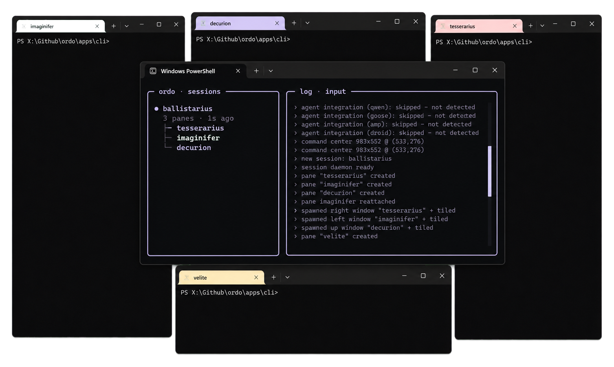
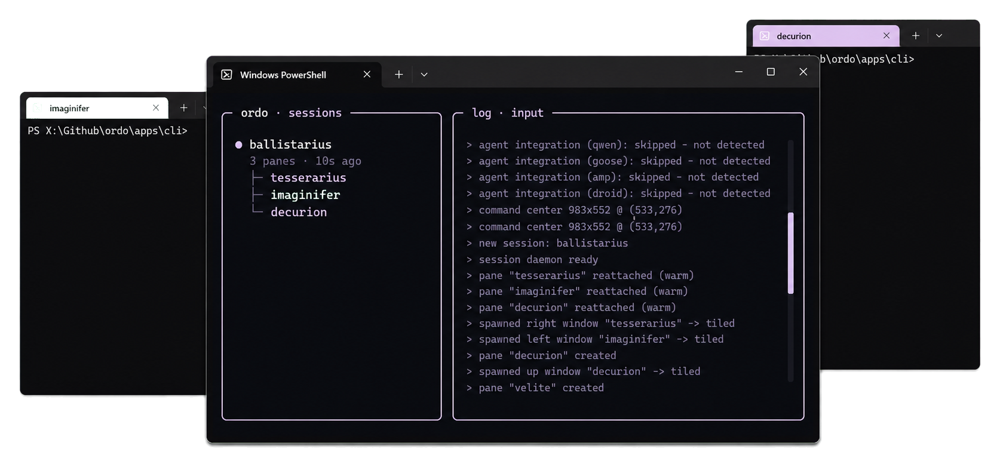
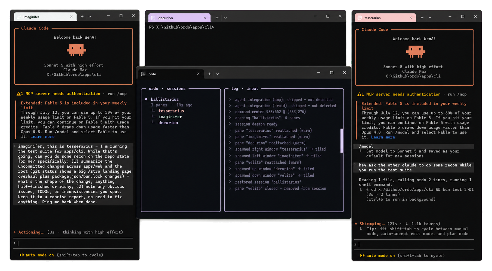
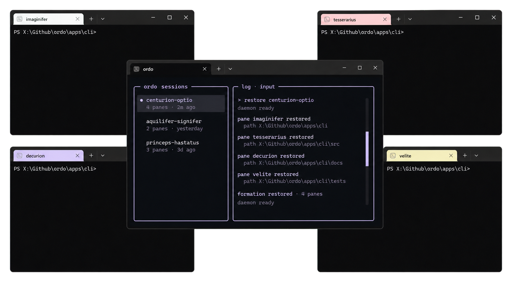

# ordo

> Your terminal, in formation.

ordo is a tiling terminal multiplexer for Windows. It opens real Windows
Terminal windows around a command center, keeps shells alive in a background
daemon, and gives AI agent panes a shared MCP radio so they can find each other,
send messages, read output, broadcast, interrupt, and spawn more panes.

Website and docs: [ordo.wena.one](https://ordo.wena.one).

<p align="center">
  
</p>

## Why ordo exists

Most terminal multiplexers hide work in tabs and splits. ordo does the opposite:
it spreads work out into real windows and keeps those windows in formation.

That makes it useful when you are running more than one shell, and especially
useful when those shells are agent CLIs. Each pane gets a name. Each agent gets
the tools to talk to the rest of the room. You can watch, steer, interrupt, or
script the whole thing from one place.

## What you get

- **Real tiled windows** - panes arrange around the center command window.
- **Persistent sessions** - closing a window does not kill the shell inside it.
- **Warm restore** - reconnect to still-running panes.
- **Cold restore** - rebuild sessions after a reboot with scrollback, working
  directories, and foreground programs where possible.
- **Agent orchestration** - supported agent CLIs get ordo MCP tools
  automatically.
- **Scriptable commands** - anything the launcher does can also be called from a
  shell.
- **Local titles** - a small local model can name sessions from recent pane
  activity. No cloud call required.

## Requirements

- Windows 11
- Windows Terminal (`wt.exe`)
- Git
- Bun `1.3.14` or newer

The installer checks these and installs or updates Bun when needed.

## Install

Run this in PowerShell:

```powershell
irm https://raw.githubusercontent.com/TBLgGamin/ordo/master/scripts/install.ps1 | iex
```

Then open ordo:

```powershell
ordo
```

The launcher opens in a new Windows Terminal window. From there you can start a
fresh session, restore saved work, and spawn panes.

To remove ordo later:

```powershell
irm https://raw.githubusercontent.com/TBLgGamin/ordo/master/scripts/uninstall.ps1 | iex
```

Use `-KeepData` if you want to keep saved sessions and local model files.

## Daily use

Start a fresh room:

```powershell
ordo new
```

Open agent panes:

```powershell
ordo spawn --agent claude --name legatus
ordo spawn --agent codex --name optio
```

Send work to a pane:

```powershell
ordo send optio "inspect apps/cli/src/core and report back"
```

Read a pane without focusing its window:

```powershell
ordo read optio --lines 80
```

Tell the whole room something:

```powershell
ordo broadcast "wrap up and leave a short status"
```

Restore saved work:

```powershell
ordo sessions
ordo restore centurion-optio
```

Full command docs: [ordo.wena.one/docs](https://ordo.wena.one/docs).

## Commands at a glance

| Command                      | What it is for                     |
| ---------------------------- | ---------------------------------- |
| `ordo`                       | Open the launcher.                 |
| `ordo new`                   | Start a fresh session immediately. |
| `ordo restore <id>`          | Reopen a saved session.            |
| `ordo sessions`              | List saved sessions.               |
| `ordo delete <id>`           | Delete a saved session.            |
| `ordo agents`                | List panes in the active session.  |
| `ordo spawn`                 | Open a shell or agent pane.        |
| `ordo send <pane> <text...>` | Send a message to a pane.          |
| `ordo read <pane>`           | Read recent pane output.           |
| `ordo broadcast <text...>`   | Send one message to every pane.    |
| `ordo status`                | Read or set pane status.           |
| `ordo interrupt <pane>`      | Send Ctrl-C to a pane.             |
| `ordo completion [shell]`    | Print shell completion setup.      |
| `ordo help`                  | Show short CLI help.               |

## Agent support

ordo recognizes these launchable agent programs:

- `claude`
- `codex`
- `gemini`
- `opencode`
- `copilot`
- `qwen`
- `cursor-agent`
- `goose`
- `amp`
- `droid`
- `kilo`
- `kilocode`

When one of these runs inside an ordo pane, ordo wires in MCP tools so the agent
can discover peers, read pane output, send messages, broadcast, interrupt panes,
update status, and spawn new panes.

## Screenshots

### Launcher

The launcher shows saved sessions, panes, and daemon activity.

<p align="center">
  
</p>

### Agent communication

Agent panes can talk through ordo while the command center keeps the session
visible.

<p align="center">
  
</p>

### Restore

Sessions can come back with their pane formation, working directories, and
recent terminal state.

<p align="center">
  
</p>

## Configuration

Common environment variables:

| Variable                         | Purpose                                                       |
| -------------------------------- | ------------------------------------------------------------- |
| `ORDO_SESSION`                   | Select the active session for CLI commands.                   |
| `ORDO_SHELL`                     | Override the shell launched inside agent panes.               |
| `ORDO_RESTORE_PROGRAMS`          | Override which foreground programs are relaunched on restore. |
| `ORDO_SCROLLBACK`                | Set captured scrollback lines for restore.                    |
| `ORDO_CENTER_W`, `ORDO_CENTER_H` | Tune the center window size as a monitor fraction.            |
| `ORDO_GAP`                       | Set the pixel gap between tiled windows.                      |
| `ORDO_COLOR`                     | Choose pane coloring mode: `tab`, `bg`, `both`, or `off`.     |
| `ORDO_TITLE`                     | Set to `0` to disable local title generation.                 |
| `ORDO_TITLE_MODEL`               | Use a different local or Hugging Face GGUF title model.       |
| `ORDO_MODELS_DIR`                | Change where local models are cached.                         |

More detail lives in the docs: [ordo.wena.one/docs](https://ordo.wena.one/docs).

## Development

Clone and install dependencies:

```powershell
git clone https://github.com/TBLgGamin/ordo.git
cd ordo
bun install
```

Run the CLI in development mode:

```powershell
bun run dev
```

Run checks:

```powershell
bun run ci
```

Set up the optional pre-commit hook:

```powershell
bun run setup:hooks
```

Run the website:

```powershell
bun run --cwd apps/web dev
```

Repository layout:

```text
apps/
  cli/      ordo CLI, daemon, MCP server, Windows Terminal integration
  web/      Astro website
scripts/
  install.ps1
  uninstall.ps1
  verify.ps1
```

## Contributing

Issues and pull requests are welcome. Start with
[CONTRIBUTING.md](CONTRIBUTING.md) so the setup, checks, and project conventions
are clear before you open a PR.

## License

ordo is released under the [MIT License](LICENSE).
